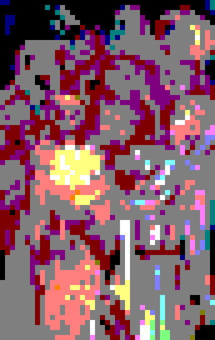

# Mosaic Pixel Matrixator

A Python tool to convert images into ceramic tile color matrices. This project takes an image as input and generates a matrix of RGB color values that represent how ceramic tiles (default 2.2cm × 2.2cm, configurable) should be arranged to replicate the image at a specified scale, while preserving the original image's aspect ratio.

## Features

- **Image Processing**: Supports common image formats (JPG, PNG, BMP, GIF, TIFF, WEBP)
- **Aspect Ratio Preservation**: Automatically maintains image proportions to prevent distortion
- **Custom Dimensions**: Specify maximum output dimensions in centimeters (dimensions are adjusted to preserve aspect ratio)
- **Color Quantization**: Uses median cut algorithm for better image quality
- **Primary Color Mix**: Shows which three primary colors (Red, Green, Blue) mix to create each color
- **Paint Color Inventory**: Lists all required paint colors with usage counts
- **Color Matrix Generation**: Converts images into matrices of RGB values with primary color mix information
- **Multiple Output Formats**: Saves matrices as both human-readable text files and JSON
- **Preview Generation**: Automatically generates a preview image showing how the tile mosaic will look
- **Timestamp-based Output**: Output files include timestamps to prevent overwrites
- **Modular Architecture**: Well-organized codebase with clear separation of concerns

## Project Structure

```
mosaic-pixel-matrixator/
├── input/                      # Place your input images here
│   └── .gitkeep               # Keeps directory in git
├── output/                     # Generated matrices are saved here
│   └── .gitkeep               # Keeps directory in git
├── examples/                   # Example images for documentation
│   └── images/                # Sample input and output images
├── src/                        # Source code
│   ├── __init__.py            # Package initialization
│   ├── config/                # Configuration constants
│   │   ├── __init__.py
│   │   └── constants.py       # Tile size and supported formats
│   ├── io/                    # Input/Output operations
│   │   ├── __init__.py
│   │   ├── image_loader.py    # Image file discovery and loading
│   │   └── file_handler.py    # Matrix file saving (TXT, JSON)
│   ├── processing/            # Image processing
│   │   ├── __init__.py
│   │   └── image_processor.py # Image resizing, RGB conversion
│   ├── generation/            # Matrix generation
│   ├── quantization/          # Color quantization and naming
│   └── visualization/         # Image visualization
├── main.py                    # Main entry point and CLI
├── requirements.txt           # Python dependencies
├── .gitignore                 # Git ignore rules
└── README.md                  # This file
```

## Installation

```bash
pip install -r requirements.txt
```

**Requirements**: Python 3.8+, Pillow >= 10.0.0, NumPy >= 1.24.0

## Usage

### Quick Start

1. **Place your image** in the `input/` folder
   - Supported formats: JPG, JPEG, PNG, BMP, GIF, TIFF, WEBP

2. **Run the script:**

   **Interactive mode:**
   ```bash
   python main.py
   ```
   Then enter the dimensions when prompted.

   **Command-line mode:**
   ```bash
   python main.py --width 200 --height 150
   ```
   
   **With custom tile size:**
   ```bash
   python main.py --width 200 --height 150 --tile-size 2.5
   ```

3. **Find the results** in the `output/` folder:
   - `{image_name}-{timestamp}.png` - Visual preview of the tile mosaic
   - `{image_name}-{timestamp}_matrix.txt` - Human-readable RGB matrix with mix info
   - `{image_name}-{timestamp}_matrix.json` - JSON format with RGB and mix percentages
   - `{image_name}-{timestamp}_paints.json` - List of required paint colors with usage counts

### Detailed Example

```bash
# 1. Place an image in input/ folder (e.g., landscape.jpg)

# 2. Run with dimensions:
python main.py --width 200 --height 150

# Output:
# Original image: 1920x1080 (aspect ratio: 1.78)
# Requested dimensions: 200cm x 150cm
# Tile size: 2.20cm x 2.20cm (default)
# Output dimensions: 200.00cm x 112.36cm
# 
# Dimension adjustments (to preserve aspect ratio 1.78):
#   Width:  200.00cm requested → 200.00cm actual (difference: +0.00cm)
#   Height: 150.00cm requested → 112.36cm actual (difference: -37.64cm)
#
# 3. Files generated in output/:
#    - landscape-20250115_143052.png (preview)
#    - landscape-20250115_143052_matrix.txt
#    - landscape-20250115_143052_matrix.json
```

## Example Results

Below is a visual example showing the transformation from input image to ceramic tile mosaic:

### Original Input Image


**Artwork Attribution:**

- **Artist**: Nanzita (Nanzita Ladeira Salgado Alvim Gomes, 1919-2007)
- **Title**: São Francisco de Assis com seus companheiros
- **Technique**: Técnica mista sobre tela (Mixed media on canvas)
- **Year**: 1986
- **Location**: Cataguases, MG, Brazil

*Original artwork that will be converted to a ceramic tile mosaic*

### Processed Output (with Color Quantization and Paint Inventory)



*Preview of the tile mosaic with median cut color quantization - optimized palette for better image quality*


## How It Works

### Processing Pipeline

1. **Image Loading**: Loads image from `input/` folder
2. **Aspect Ratio Calculation**: Calculates and preserves aspect ratio
3. **Dimension Calculation**: Chooses closest match to requested dimensions
4. **Matrix Size Calculation**: Calculates tiles needed (dimensions ÷ tile size)
5. **Image Resizing**: Resizes to matrix dimensions
6. **Color Quantization**: Uses median cut algorithm to create optimized palette
7. **Primary Color Mix**: Calculates Red, Green, Blue mix percentages for each color
8. **Matrix Generation**: Creates RGB matrix with primary color mix information
9. **File Output**: Saves matrix in TXT and JSON formats
10. **Preview Generation**: Creates visual preview image

### Key Rules

- **Aspect Ratio**: Always preserved (no distortion)
- **Closest Match**: Dimensions use closest match algorithm
- **Primary Color Mix**: Each color shows R%, G%, B% percentages for mixing
- **Tile Size**: Default 2.2cm, customizable via `--tile-size`
- **Color Quantization**: Default 64 colors using median cut, customizable via `--num-colors`

### Color Naming System

Colors are automatically named using ranges:
- **Green variants**: green, light-green, dark-green
- **Red variants**: red, light-red, dark-red  
- **Blue variants**: blue, light-blue, dark-blue
- **Neutrals**: white, light-gray, gray, dark-gray, black
- **Other**: yellow, orange, purple, brown, pink, cyan

Example: A light green (200, 230, 200) closer to white will be named "light-green" or mapped appropriately.

## Tile Specifications

- **Default tile size**: 2.2cm × 2.2cm (configurable via `--tile-size` parameter)
- **Tile size options**: Can be specified via command line or interactive prompt
- **Color format**: RGB (Red, Green, Blue) values from 0-255
- **Matrix structure**: Array of arrays where each cell represents one tile
- **Scale calculation**: 
  - Matrix dimensions = Output dimensions ÷ Tile size
  - Example: 200cm ÷ 2.2cm = 90.9 → 90 columns (integer division)
  - Example: 100cm ÷ 2.2cm = 45.5 → 45 rows (integer division)

## Output Format

### Preview Image (`{name}-{timestamp}.png`)
A visual representation of how the ceramic tile mosaic will look. The image is upscaled 10x for better visibility while maintaining the pixelated tile effect.

### Text Matrix (`{name}-{timestamp}_matrix.txt`)
Human-readable format with RGB values and primary color mix:

```
# RGB Color Matrix
# Matrix dimensions: 56 rows x 100 columns
# Format: R,G,B[R:red%,G:green%,B:blue%] - Mix of three primary colors

# Row 1
109,73,77[R:42.7%,G:28.6%,B:30.2%] 111,76,80[R:43.5%,G:29.8%,B:31.4%] ...
# Row 2
107,73,77[R:42.0%,G:28.6%,B:30.2%] 109,76,79[R:42.7%,G:29.8%,B:31.0%] ...
...
```

Each color shows the percentage of Red, Green, and Blue primaries needed to mix that color.

### JSON Matrix (`{name}-{timestamp}_matrix.json`)
Structured format with RGB and primary color mix:

```json
{
  "dimensions": {
    "rows": 56,
    "columns": 100
  },
  "matrix": [
    [
      {
        "rgb": [109, 73, 77],
        "red": 109,
        "green": 73,
        "blue": 77,
        "red_pct": 42.7,
        "green_pct": 28.6,
        "blue_pct": 30.2
      },
      {
        "rgb": [111, 76, 80],
        "red": 111,
        "green": 76,
        "blue": 80,
        "red_pct": 43.5,
        "green_pct": 29.8,
        "blue_pct": 31.4
      },
      ...
    ],
    ...
  ]
}
```

Each entry shows RGB values and the percentage of each primary color (Red, Green, Blue) needed to mix that color.

### Paint Colors List (`{name}-{timestamp}_paints.json`)

List of all unique paint colors needed with usage counts:

```json
{
  "total_unique_colors": 64,
  "total_tiles": 2924,
  "required_paints": [
    {
      "rgb": [255, 255, 255],
      "red": 255,
      "green": 255,
      "blue": 255,
      "count": 245,
      "red_pct": 100.0,
      "green_pct": 100.0,
      "blue_pct": 100.0
    },
    {
      "rgb": [200, 150, 100],
      "red": 200,
      "green": 150,
      "blue": 100,
      "count": 180,
      "red_pct": 78.4,
      "green_pct": 58.8,
      "blue_pct": 39.2
    },
    ...
  ]
}
```

Colors are sorted by usage count (most used first). This tells you exactly which paint colors to buy and in what quantities.

## Architecture

Modular architecture:
- **`config/`**: Configuration constants
- **`io/`**: File I/O operations
- **`processing/`**: Image processing
- **`generation/`**: Matrix generation
- **`quantization/`**: Color quantization and naming
- **`visualization/`**: Preview generation

See [ARCHITECTURE.md](ARCHITECTURE.md) for details.

## Command-Line Options

```bash
python main.py [--width WIDTH] [--height HEIGHT] [--tile-size TILE_SIZE] [--num-colors NUM_COLORS] [--no-quantize]

Options:
  --width       Maximum output width in centimeters
  --height      Maximum output height in centimeters
  --tile-size   Tile size in centimeters (default: 2.2cm)
  --num-colors  Number of colors in palette for quantization (default: 64)
  --no-quantize Disable color quantization (use original image colors)

If no arguments provided, the script will prompt for dimensions and tile size interactively.
```

### Color Quantization

Color quantization maps each pixel's color to the closest color in a predefined palette. This ensures:
- Colors are easy to obtain for ceramic tiles
- Similar colors are grouped together (e.g., light green → white if closer)
- Reduced color variations for easier tile painting
- Configurable palette size (fewer colors = easier to obtain, more colors = more accuracy)

The quantization uses **Euclidean distance** in RGB space to find the closest match, similar to how dimensions use closest match.

## Troubleshooting

### No image files found
- Ensure your image is in the `input/` folder
- Check that the file format is supported (JPG, PNG, BMP, GIF, TIFF, WEBP)

### Dimensions seem incorrect
- The tool preserves aspect ratio, so actual dimensions may differ from requested
- Check the output message for the actual dimensions used

### Import errors
- Ensure all dependencies are installed: `pip install -r requirements.txt`
- Check that you're using Python 3.8 or higher

## License

MIT License - feel free to use this project for any purpose.

## Contributing

Contributions are welcome! Please ensure your code follows the existing architecture and includes appropriate documentation.
