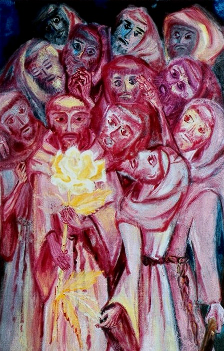

# Mosaic Pixel Matrixator

A Python tool to convert images into ceramic tile color matrices. This project takes an image as input and generates a matrix of RGB color values that represent how ceramic tiles (2x2cm) should be arranged to replicate the image at a specified scale, while preserving the original image's aspect ratio.

## Features

- **Image Processing**: Supports common image formats (JPG, PNG, BMP, GIF, TIFF, WEBP)
- **Aspect Ratio Preservation**: Automatically maintains image proportions to prevent distortion
- **Custom Dimensions**: Specify maximum output dimensions in centimeters (dimensions are adjusted to preserve aspect ratio)
- **Color Matrix Generation**: Converts images into matrices of RGB values
- **Multiple Output Formats**: Saves matrices as both human-readable text files and JSON
- **Preview Generation**: Automatically generates a preview image showing how the tile mosaic will look
- **Timestamp-based Output**: Output files include timestamps to prevent overwrites
- **Modular Architecture**: Well-organized codebase with clear separation of concerns

## Project Structure

```
mosaic-pixel-matrixator/
├── input/                      # Place your input images here
│   └── .gitkeep               # Keeps directory in git
├── output/                     # Generated matrices are saved here
│   └── .gitkeep               # Keeps directory in git
├── examples/                   # Example images for documentation
│   └── images/                # Sample input and output images
├── src/                        # Source code
│   ├── __init__.py            # Package initialization
│   ├── config/                # Configuration constants
│   │   ├── __init__.py
│   │   └── constants.py       # Tile size and supported formats
│   ├── io/                    # Input/Output operations
│   │   ├── __init__.py
│   │   ├── image_loader.py    # Image file discovery and loading
│   │   └── file_handler.py    # Matrix file saving (TXT, JSON)
│   ├── processing/            # Image processing
│   │   ├── __init__.py
│   │   └── image_processor.py # Image resizing, RGB conversion
│   ├── generation/            # Matrix generation
│   │   ├── __init__.py
│   │   └── matrix_generator.py # Matrix creation, dimension calculations
│   └── visualization/         # Image visualization
│       ├── __init__.py
│       └── image_recreator.py # Preview image generation
├── main.py                    # Main entry point and CLI
├── requirements.txt           # Python dependencies
├── .gitignore                 # Git ignore rules
└── README.md                  # This file
```

## Installation

1. **Clone or download this repository**

2. **Install the required dependencies:**
```bash
pip install -r requirements.txt
```

### Requirements

- Python 3.8 or higher
- Pillow (PIL) >= 10.0.0 - Image processing library
- NumPy >= 1.24.0 - Matrix operations

## Usage

### Quick Start

1. **Place your image** in the `input/` folder
   - Supported formats: JPG, JPEG, PNG, BMP, GIF, TIFF, WEBP

2. **Run the script:**

   **Interactive mode:**
   ```bash
   python main.py
   ```
   Then enter the dimensions when prompted.

   **Command-line mode:**
   ```bash
   python main.py --width 200 --height 150
   ```

3. **Find the results** in the `output/` folder:
   - `{image_name}-{timestamp}.png` - Visual preview of the tile mosaic
   - `{image_name}-{timestamp}_matrix.txt` - Human-readable RGB matrix
   - `{image_name}-{timestamp}_matrix.json` - JSON format for programmatic use

### Detailed Example

```bash
# 1. Place an image in input/ folder (e.g., landscape.jpg)

# 2. Run with dimensions:
python main.py --width 200 --height 150

# Output:
# Original image: 1920x1080 (aspect ratio: 1.78)
# Requested dimensions: 200cm x 150cm
# Output dimensions: 200.00cm x 112.36cm
# Note: Dimensions adjusted to preserve aspect ratio (maintained at 1.78)
#
# 3. Files generated in output/:
#    - landscape-20250115_143052.png (preview)
#    - landscape-20250115_143052_matrix.txt
#    - landscape-20250115_143052_matrix.json
```

## Example Results

Below is a visual example showing the transformation from input image to ceramic tile mosaic at different scales:

### Original Input Image



**Artwork Attribution:**

- **Artist**: Nanzita (Nanzita Ladeira Salgado Alvim Gomes, 1919-2007)
- **Title**: São Francisco de Assis com seus companheiros
- **Technique**: Técnica mista sobre tela (Mixed media on canvas)
- **Year**: 1986
- **Location**: Cataguases, MG, Brazil

*Original artwork that will be converted to a ceramic tile mosaic*

### Output at Smaller Scale


*Preview of the tile mosaic at smaller dimensions - showing finer detail*

### Output at Larger Scale


*Preview of the tile mosaic at larger dimensions - showing pixelated tile effect more clearly*

These examples demonstrate how the tool:
- Preserves the original image's aspect ratio
- Maintains color accuracy in RGB values
- Shows the pixelated tile effect that will be visible in the final ceramic mosaic
- Scales appropriately for different output sizes

## How It Works

1. **Image Loading**: The tool loads the image from the `input/` folder
2. **Aspect Ratio Calculation**: Calculates the original image's aspect ratio
3. **Dimension Adjustment**: Adjusts requested dimensions to maintain aspect ratio (fits within max bounds)
4. **Matrix Size Calculation**: Based on adjusted dimensions and tile size (2cm x 2cm), calculates the matrix dimensions
5. **Image Resizing**: The image is resized to match the matrix dimensions using high-quality resampling
6. **Color Extraction**: Each pixel in the resized image represents a tile, and its RGB values are extracted
7. **Matrix Generation**: The RGB values are organized into a matrix (array of arrays)
8. **File Output**: The matrix is saved in both text and JSON formats
9. **Preview Generation**: A preview image is created from the matrix to visualize the final result

### Aspect Ratio Preservation

When you provide dimensions (e.g., 200cm x 150cm), the tool automatically:
- Calculates the original image's aspect ratio
- Adjusts dimensions to fit within your specified bounds while maintaining the aspect ratio
- Ensures no distortion of the image

For example, if your image is 16:9 and you request 200cm x 150cm:
- The tool will adjust to approximately 200cm x 112.5cm to maintain the 16:9 ratio

## Tile Specifications

- **Default tile size**: 2cm × 2cm (configurable in `src/config/constants.py`)
- **Color format**: RGB (Red, Green, Blue) values from 0-255
- **Matrix structure**: Array of arrays where each cell represents one tile

## Output Format

### Preview Image (`{name}-{timestamp}.png`)
A visual representation of how the ceramic tile mosaic will look. The image is upscaled 10x for better visibility while maintaining the pixelated tile effect.

### Text Matrix (`{name}-{timestamp}_matrix.txt`)
Human-readable format with RGB values:

```
# RGB Color Matrix
# Matrix dimensions: 56 rows x 100 columns
# Format: R,G,B for each tile

# Row 1
109,73,77 111,76,80 114,78,82 ...
# Row 2
107,73,77 109,76,79 112,78,82 ...
...
```

### JSON Matrix (`{name}-{timestamp}_matrix.json`)
Structured format for programmatic use:

```json
{
  "dimensions": {
    "rows": 56,
    "columns": 100
  },
  "matrix": [
    [
      [109, 73, 77],
      [111, 76, 80],
      [114, 78, 82],
      ...
    ],
    ...
  ]
}
```

## Architecture

The project follows a modular architecture with clear separation of concerns:

- **`config/`**: Centralized configuration constants
- **`io/`**: Input/Output operations (file handling, image loading)
- **`processing/`**: Core image processing operations (resizing, conversion)
- **`generation/`**: Matrix generation logic (dimensions, aspect ratio calculations)
- **`visualization/`**: Preview image generation

See [ARCHITECTURE.md](ARCHITECTURE.md) for detailed technical documentation.

## Command-Line Options

```bash
python main.py [--width WIDTH] [--height HEIGHT]

Options:
  --width   Maximum output width in centimeters
  --height  Maximum output height in centimeters

If no arguments provided, the script will prompt for dimensions interactively.
```

## Troubleshooting

### No image files found
- Ensure your image is in the `input/` folder
- Check that the file format is supported (JPG, PNG, BMP, GIF, TIFF, WEBP)

### Dimensions seem incorrect
- The tool preserves aspect ratio, so actual dimensions may differ from requested
- Check the output message for the actual dimensions used

### Import errors
- Ensure all dependencies are installed: `pip install -r requirements.txt`
- Check that you're using Python 3.8 or higher

## License

MIT License - feel free to use this project for any purpose.

## Contributing

Contributions are welcome! Please ensure your code follows the existing architecture and includes appropriate documentation.
