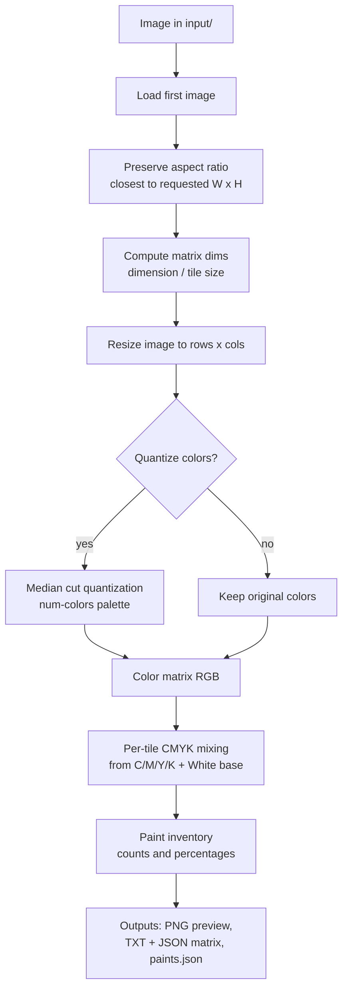

# mosaic-pixel-matrixator

Transforms images into ceramic tile mosaics using color quantization and CMYK paint-mixing instructions. It resizes a source image to a tile grid, reduces the palette with a median cut quantizer, and emits a visual preview plus machine-readable matrices telling you which color to paint each tile and how to mix it from a CMYK + white base set.

[](https://github.com/fabricioguidine/mosaic-pixel-matrixator/actions/workflows/ci.yml) [](LICENSE) [](https://www.python.org/)

## Features

- **Auto-discovery:** reads the first image found in `input/` (JPG, JPEG, PNG, BMP, GIF, TIFF, WEBP).
- **Aspect-ratio preserving:** picks output dimensions closest to the requested width/height without distorting the image.
- **Tile grid:** splits the canvas into a matrix based on a configurable tile size (default 2.2 cm).
- **Color quantization:** reduces the palette with a median cut quantizer (default 32 colors), or keeps original colors with `--no-quantize`.
- **Color representations:** computes RGB, Hex, CMYK and HSL for every color, plus per-tile mixing instructions from the 5 base paints (Cyan, Magenta, Yellow, Black, White).
- **Paint inventory:** tracks unique colors with per-color tile counts and percentages.
- **Multiple outputs:** writes a PNG preview, a human-readable TXT matrix, a JSON matrix, and a paint-inventory JSON per run.

## Requirements

- Python 3.10 or higher
- Pillow >= 10.0.0
- NumPy >= 1.24.0

## Installation

```powershell
git clone https://github.com/fabricioguidine/mosaic-pixel-matrixator.git
cd mosaic-pixel-matrixator
pip install -r requirements.txt
```

For development (tests, linting, type-checking):

```powershell
pip install -e ".[dev]"
```

## Usage

Place an image in the `input/` folder, then run `main.py`. If `--width` and `--height` are omitted, the tool prompts for them interactively. Only the first image in `input/` is processed per run.

```powershell
# Interactive: prompts for width, height and tile size
python main.py

# Provide dimensions directly (centimeters)
python main.py --width 200 --height 150

# Custom tile size
python main.py --width 200 --height 150 --tile-size 2.5

# Larger palette
python main.py --width 200 --height 150 --num-colors 128

# Skip quantization (use original colors)
python main.py --width 200 --height 150 --no-quantize
```

| Option | Description | Default |
|--------|-------------|---------|
| `--width` | Output width in centimeters | Prompted |
| `--height` | Output height in centimeters | Prompted |
| `--tile-size` | Tile size in centimeters | `2.2` |
| `--num-colors` | Colors in the quantized palette | `32` |
| `--no-quantize` | Disable quantization, keep original colors | `False` |

## How it works


```mermaid
flowchart TD
    A[Image in input/] --> B[Load first image]
    B --> C[Preserve aspect ratio<br/>closest to requested W x H]
    C --> D[Compute matrix dims<br/>dimension / tile size]
    D --> E[Resize image to rows x cols]
    E --> F{Quantize colors?}
    F -- yes --> G[Median cut quantization<br/>num-colors palette]
    F -- no --> H[Keep original colors]
    G --> I[Color matrix RGB]
    H --> I
    I --> J[Per-tile CMYK mixing<br/>from C/M/Y/K + White base]
    J --> K[Paint inventory<br/>counts and percentages]
    K --> L[Outputs: PNG preview,<br/>TXT + JSON matrix, paints.json]
```

1. Loads the first image found in `input/`.
2. Calculates output dimensions that preserve the image's aspect ratio, picking the option closest to the requested width and height.
3. Derives the matrix size in tiles (`dimension / tile size`).
4. Resizes the image to that tile grid.
5. Quantizes the palette with median cut (unless `--no-quantize` is set).
6. Converts each tile color to CMYK and computes mixing percentages from the base paints (Cyan, Magenta, Yellow, Black, White).
7. Builds a paint inventory of unique colors with tile counts and percentages.
8. Writes the preview PNG and the TXT / JSON matrices plus the paints inventory to `output/`.

## Output

Each run writes four files to `output/`, named `{image}-{timestamp}`:

| File | Contents |
|------|----------|
| `{image}-{timestamp}.png` | Visual preview of the mosaic (tiles scaled up 10x). |
| `{image}-{timestamp}_matrix.txt` | Human-readable matrix: base colors to purchase, tiles-to-paint summary, per-tile mixing instructions. |
| `{image}-{timestamp}_matrix.json` | The matrix as JSON: `dimensions`, `total_tiles`, `total_unique_colors`, a `tiles_to_paint` summary, and the full `matrix` with RGB/Hex/CMYK/HSL per tile. |
| `{image}-{timestamp}_paints.json` | Paint inventory: `total_unique_colors`, `total_tiles`, and `required_paints` with RGB/Hex/CMYK/HSL and usage counts. |

The console also prints a per-color table (Hex, RGB, CMYK, tile count, percentage) and the set of base colors to purchase.

Sample TXT header:

```
# RGB Color Matrix with Paint Mixing Instructions
# Matrix dimensions: 68 rows x 43 columns
# Total tiles: 2924
# Format: R,G,B[CMYK] #HEX {mix_instruction}

# BASE COLORS TO PURCHASE:
# - CYAN: RGB[0, 255, 255] #00FFFF CMYK(100.0%,0.0%,0.0%,0.0%)
# - MAGENTA: RGB[255, 0, 255] #FF00FF CMYK(0.0%,100.0%,0.0%,0.0%)
# - YELLOW: RGB[255, 255, 0] #FFFF00 CMYK(0.0%,0.0%,100.0%,0.0%)
# - BLACK: RGB[0, 0, 0] #000000 CMYK(0.0%,0.0%,0.0%,100.0%)
# - WHITE: RGB[255, 255, 255] #FFFFFF CMYK(0.0%,0.0%,0.0%,0.0%)
```

## Example

<table width="100%">
<tr>
<th width="50%">Input</th>
<th width="50%">Output</th>
</tr>
<tr>
<td></td>
<td></td>
</tr>
</table>

This sample run produced:

- 68 rows x 43 columns (2,924 tiles)
- 95.79 cm x 150.00 cm output (aspect ratio preserved)
- 32 unique colors via median cut quantization
- 5 base colors to purchase (Cyan, Magenta, Yellow, Black, White)

Source artwork: *São Francisco de Assis com seus companheiros* (1986), mixed media on canvas, by Nanzita (Nanzita Ladeira Salgado Alvim Gomes, 1919-2007), Cataguases, MG, Brazil.

## Project structure

```
mosaic-pixel-matrixator/
├── main.py              # CLI entry point
├── input/               # Source images (first one is processed)
├── output/              # Generated previews and matrices
├── examples/images/     # Sample input/output for docs
├── src/
│   ├── config/          # Constants (tile size, supported formats)
│   ├── io/              # Image loading, matrix file output
│   ├── processing/      # Image resize/convert
│   ├── generation/      # Matrix dimensions and generation
│   ├── quantization/    # Median cut, CMYK/HSL, paint inventory
│   └── visualization/   # Preview image recreation
├── tests/               # Pytest suite + fixtures
├── pyproject.toml
└── requirements.txt
```

See [ARCHITECTURE.md](ARCHITECTURE.md) for module-level detail.

## Testing

```powershell
# Run the suite with coverage (configured in pyproject.toml)
pytest

# A single test file
python -m pytest tests/test_color_quantizer.py
```

## License

Licensed under the [MIT License](LICENSE).
